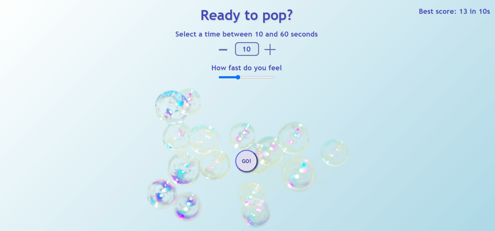

# Nathan-simonnet.github.io
Bubble popper 

## Technos

## How to use it
+ Select between 10 and 60 seconds
+ Click GO
+ Pop them!
+ Select again
+ Restart

## Additional comments
One of my oldest, yet favorite JS project.
Highly improveable indeed, but highly homemade. And without library or else, i'ts enjoyable.
Developed in collaboration with my 9 year old sister. Any negative reviews are therefore at your own risk. 

